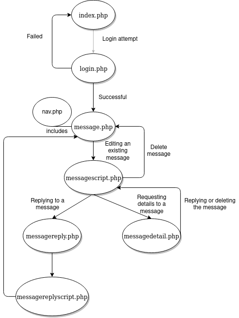
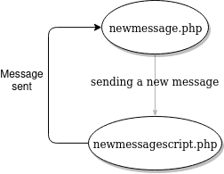
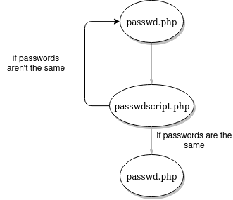
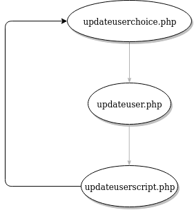
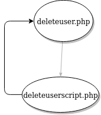

# STI - Projet 2 

# Autheurs : Nair Alic - Jeremy Zerbib

## Identification de menaces et correction de faille dans une application WEB

### Manuel utilisateur

L'ancien document détaillant l'utilisation du site se trouve [ici](./docs/old_README.md).

### Etude de menace

#### Analyse de prime abord

- Mapping de l'application et quels appels sont faits à quel moment.
- Nous avons essayé de *sniffer* des mots de passe avec `wireshark` et nous avons trouvé que ces derniers sont envoyés en clair.
- Ensuite, nous avons essayé de faire des injections `XSS` et nous y arrivons avec succès.  
- SQL injection ne marche pas à priori.
- Escalation de privilèges facile à faire lors de la création d'un nouvel utilisateur sinon pas possible.
- Possiblité de lire les mails des autres utilisateurs.
- A priori pas de serveur d'application
- Analyse du code source et utilisation de techniques douteuses.

#### Analyse détaillée

##### Mapping de l'application

**Détails de l'analyse**

Nous avons choisi de faire un mapping depuis la page d'accueil. Sur cette page, nous voyons que le fichier *index.php* est appelé. Nous pouvons voir que ce fichier fait office de page de *login* et qu'aucune autre action ne peut être faite à  priori. Une fois authentifié, l'utilisateur a accès à la barre de navigation qui permet de faire toutes les actions demandées par le cahier des charges.

Vous pouvez trouver le mapping de l'application grâce aux illustrations ci-dessous : 

**Mapping de *index.php* ** 

**Mapping de *nav.php* **

**Mapping de *new message* **

**Mapping de *passwd* **

**Mapping de *adduser* **

**Mapping de *updateuserchoice* **

**Mapping de *deleteuser* **

**Mapping de *logout* **

##### Sauter les étapes de contrôles côté client

**Step by step analyse** 

**Scénario**

**Risques si cassé**

##### Attaque de l'authentification

**Step by step analyse** 

**Scénario**

**Risques si cassé**

##### Attaque de session

**Step by step analyse** 

**Scénario**

**Risques si cassé**

##### Attaque des contrôle d'accès

**Step by step analyse** 

**Scénario**

**Risques si cassé**

##### Attaque de la base de donnée

**Step by step analyse** 

**Scénario**

**Risques si cassé**

##### Attaque du back-end

**Step by step analyse** 

**Scénario**

**Risques si cassé**

##### Attaque de la logique d'application

**Step by step analyse** 

**Scénario**

**Risques si cassé**

##### Attaque côté utilisateur (XSS)

**Step by step analyse** 

**Scénario**

**Risques si cassé**

##### Autres techniques d'attaques 

**Step by step analyse** 

**Scénario**

**Risques si cassé**

##### Vulnérabilités dans le code source

**Step by step analyse** 

**Scénario**

**Risques si cassé**

 ### Patch de l'application

**Enumaration des fixs faits sur l'app**

**Comment on l'a fait ?** 

- Détail Faille par faille 

